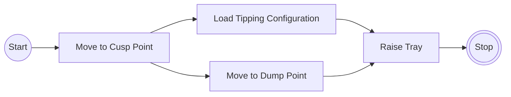

```mermaid
flowchart LR
  id1((Start)) --> id2[Move to Cusp Point]
  id2 --> id3[Move to Dump Point]
  id2 --> id4[Load Tipping Configuration]
  id4 --> id5[Raise Tray]
  id3 --> id5
  id5 --> id20(((Stop)))
```
